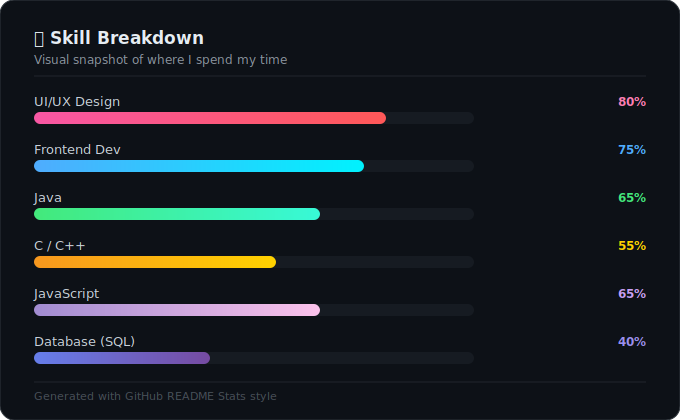

<!-- Animated Header Banner -->

<!-- Typing Animation -->

 

<!-- Social Badges -->

<!---->

---

## 🧠 About Me

<table>
  <tr><td>👤 <b>Name</b></td><td>Pruthvi</td></tr>
  <tr><td>📍 <b>Location</b></td><td>Bengaluru, Karnataka, India 🇮🇳</td></tr>
  <tr><td>🎓 <b>Education</b></td><td>B.Tech — Computer Science & Design (3rd Year)</td></tr>
  <tr><td>🎯 <b>Focus</b></td><td>Designer · Frontend Dev · UI/UX · Creative Coding</td></tr>
  <tr><td>🚀 <b>Status</b></td><td>Open to Internships & Collaborations</td></tr>
  <tr><td>💬 <b>Vibe</b></td><td><i>"Design is not just what it looks like — it's how it works."</i></td></tr>
</table>

## 🛠️ Tech Stack & Skills

### 💻 Languages

### 🎨 Design & Frontend

### 🗄️ Tools & Platforms

---

## 📊 Skill Breakdown

  

---

## 🚀 Projects

| 🧩 Project | 📄 Description | 🔧 Tech Stack |
|-----------|---------------|--------------|
| 🎨 **[PaletteVerse](#)** | Brief description of what it does | HTML, CSS, Firebase |
| 🛒 **[ReviewIQ](#)** | Built a full-stack AI pipeline that ingests messy, multilingual Indian e-commerce reviews and detects emerging complaint trends using Claude AI and Z-score statistical analysis — before they become business crises. The system extracts per-feature sentiment from Hinglish text, scores issues by business urgency, and generates team-specific action briefs with a "Do NOT Do" section, all surfaced through a 9-tab Streamlit dashboard with real-time bot detection and a one-click Decision Mode for non-technical stakeholders. | Python, MySQL, Streamlit, SQLite, FastAPI|

---

## 📈 GitHub Stats

---

## 🌱 Currently

- 🔭 Working on **Adaptive Multi-Tenant AI Platform for Scalable Personalized Model Design and Deployment**
- 🌱 Learning **OOPS · Java · DSA**
- 🎨 Exploring **UI/UX Design & Frontend Design**
- 💬 Ask me about **UI/UX, Frontend, Python**
- 📫 Reach me at **pruthvirajug1315@gmail.com**
- ⚡ Fun fact: I design before I code — wireframes are my rough drafts 🖊️

---

<!-- Footer Wave -->

**_"First, solve the problem. Then, write the code."_** ✨

